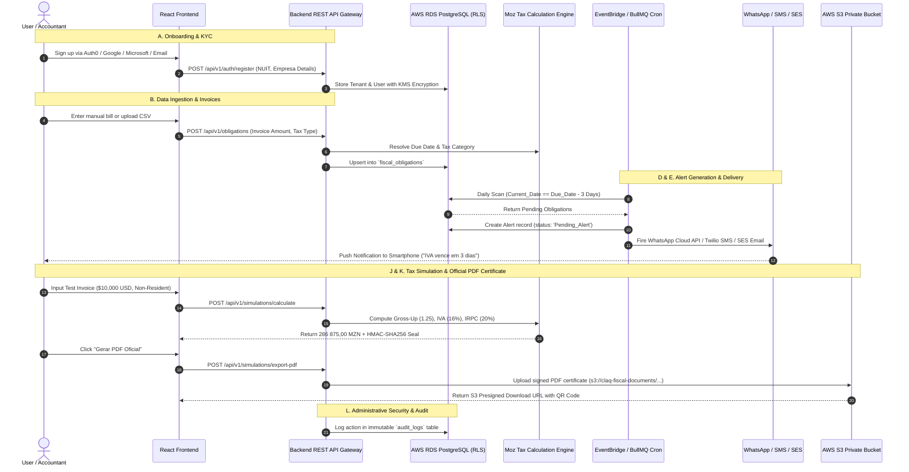

# ⚙️ CLAQ Fiscal Alert – Backend Engineering Blueprint & Cloud Architecture Guide

---

## 1. Executive Summary & Core Mission
Welcome to the Backend & Cloud Infrastructure Engineering Team of **CLAQ Fiscal Alert**. Your mission is to build, scale, and secure the central API layer, tax mathematical calculation microservice, multi-channel notification dispatcher, and AWS cloud persistence for Mozambique's premier tax compliance SaaS platform.

---

## 2. A to Z End-to-End Data Flow



---

## 3. Database Schema Design (ERD & Row-Level Security)

The database runs on **AWS RDS PostgreSQL 16** with **Prisma ORM** (`backend/prisma/schema.prisma`).

### Entity-Relationship Architecture:
1. **`companies` (Tenants)**: `id (UUID PK)`, `legal_name`, `nuit (9 digits, unique)`, `plan_tier` (`PME`, `CONTABILIDADE`, `ENTERPRISE`), `city`, `province`, `plan_renews_at`.
2. **`users`**: `id (UUID PK)`, `company_id (FK)`, `email (unique)`, `password_hash (Argon2id)`, `full_name`, `phone`, `role` (`SUPER_ADMIN`, `ACCOUNTING_ADMIN`, `SENIOR_ACCOUNTANT`, `CLIENT_VIEWER`), `is_active`.
3. **`clients`**: `id (UUID PK)`, `company_id (FK)`, `name`, `nuit (9 digits)`, `plan`, `status` (`regular`, `alerta`, `critico`), `contact_email`, `contact_phone`, `health_score`.
4. **`fiscal_obligations`**: `id (UUID PK)`, `company_id (FK)`, `client_id (FK, nullable)`, `title`, `category` (`IVA`, `INSS`, `IRPS`, `IRPC`, `TAE`, `ALVARA`), `reference_period`, `due_date`, `estimated_amount (DECIMAL(18,2))`, `status` (`PENDING`, `UPCOMING`, `SETTLED`, `OVERDUE`), `authority` (`AT`, `INSS`, `MUNICIPIO`), `payment_reference`.
5. **`tax_simulations`**: `id (UUID PK)`, `company_id (FK)`, `user_id (FK)`, `simulator_type`, `original_amount`, `exchange_rate`, `mzn_amount`, `gross_up_factor`, `tax_base`, `iva_amount`, `irpc_amount`, `total_tax`, `digital_seal_hash (SHA-256)`, `pdf_url`.
6. **`alerts`**: `id (UUID PK)`, `company_id (FK)`, `obligation_id (FK)`, `title`, `message`, `severity` (`CRITICAL`, `WARNING`, `INFO`), `due_date`, `days_remaining`, `is_read`.
7. **`exchange_rate_cache`**: `rate_date (Date)`, `currency (USD, EUR, ZAR, GBP)`, `rate_mzn`, `source`, `fetched_at`.
8. **`audit_logs`**: `id (UUID PK)`, `company_id`, `user_id`, `action_type`, `entity_name`, `ip_address`, `user_agent`, `payload_diff`, `created_at`.

### Row-Level Security (RLS) Isolation
Every table containing customer data has PostgreSQL RLS enabled (`backend/prisma/migrations/0_init/migration.sql`):
```sql
ALTER TABLE fiscal_obligations ENABLE ROW LEVEL SECURITY;
CREATE POLICY tenant_isolation_obligations ON fiscal_obligations
  USING (company_id = current_tenant_id() OR current_tenant_id() IS NULL)
  WITH CHECK (company_id = current_tenant_id());
```

---

## 4. Mozambican Tax Engine & Hot-Swapping Tables

Located in [`backend/src/taxEngine.ts`](file:///Users/amiromarwork/Documents/Projects/WEB/backend/src/taxEngine.ts):

### 1. Pagamento de Serviços a Não Residentes:
$$\text{Valor MZN} = \text{Invoice USD} \times \text{Exchange Rate}$$
$$\text{Base de Incidência (Contra-Valor)} = \text{Valor MZN} \times 1.25 \quad (\text{Fator Gross-Up})$$
$$\text{IVA (16\%)} = \text{Base} \times 0.16 \quad (\text{Lei n.º 1/2018})$$
$$\text{IRPC (20\%)} = \text{Base} \times 0.20 \quad (\text{Lei n.º 34/2014})$$
$$\text{Total de Impostos} = \text{IVA} + \text{IRPC} = 286\,875,00\text{ MZN} \quad (\text{para } \$10\,000\text{ USD a } 63.75)$$

### 2. Salário Líquido / INSS (CIRPS 2026):
- **INSS Trabalhador**: 3%
- **INSS Entidade Patronal**: 4%
- **CIRPS**: Progressive brackets ($0\% \le 20\,249\text{ MZN}$, $10\%$, $15\%$, $20\%$, $32\% > 144\,000\text{ MZN}$).

---

## 5. Mozambican Payment Gateway Integrations

Located in `backend/src/modules/payments/`:

1. **Vodacom M-Pesa (`mpesa/mpesa.service.ts`)**:
   - C2B Endpoint: Initiates USSD PIN push prompt to customer phone (`+258 84/85`).
   - Webhook: Receives `INS-0` success code and updates subscription status.
2. **Movitel E-Mola (`emola/emola.service.ts`)**:
   - C2B push prompt for `+258 86/87` numbers.
3. **SIMO Rede / Ponto24 (`simo/simo.service.ts`)**:
   - Card payments (Visa, Mastercard, Ponto24 debit).
4. **Bancos Moçambique (`bank-transfer/bankTransfer.service.ts`)**:
   - Generates Entidade (`99001`) + Referência (`400 889 900`) for **Millennium BIM**, **BCI**, and **Standard Bank**.

---

## 6. Multi-Channel Notification Dispatcher

Located in `backend/src/modules/notifications/` and `backend/src/workers/alertScheduler.ts`:
- **Daily Cron (07:00 CAT)**: Checks obligations due in 7, 3, 1, and 0 days.
- **WhatsApp**: Meta WhatsApp Cloud API template (`iva_alert`, `inss_alert`, `tae_alert`).
- **SMS**: Twilio / Africa's Talking gateway.
- **Email**: AWS SES with DKIM/SPF verification.

---

## 7. Cloud Infrastructure as Code (AWS & Terraform)

Located in `infra/terraform/`:
- **`rds.tf`**: AWS RDS PostgreSQL 16 Multi-AZ with `pgvector` and KMS encryption.
- **`ecs.tf`**: AWS ECS Fargate cluster running containerized backend API and BullMQ worker.
- **`s3.tf`**: Encrypted S3 bucket with CloudFront CDN for PDF certificate delivery.
- **`main.tf`**: VPC with 2 Public and 2 Private Subnets.

---

## 8. How to Run & Test Backend Locally

```bash
# Start backend in watch mode:
npm run dev:backend

# Run automated end-to-end API test suite:
npx tsx server/src/main.ts
```
Server runs on **`http://127.0.0.1:4000/api/v1`**.
