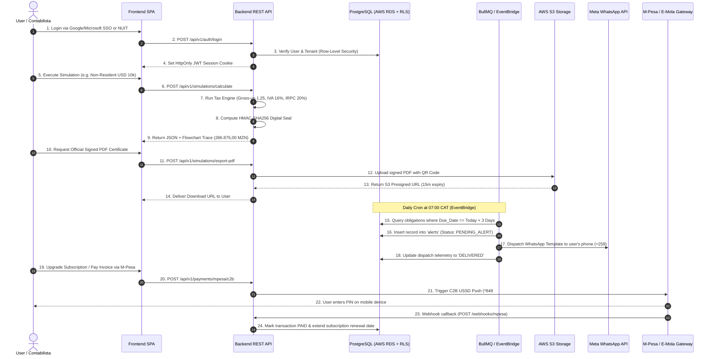

# ⚙️ CLAQ Fiscal Alert – Backend Engineering Handbook

## 1. System Objective & Architecture Overview
Backend Engineer idea to develop and operate the cloud-native API services, database models, mathematical calculation engines, payment gateways, and background cron schedulers powering the **CLAQ Fiscal Alert** platform in Mozambique.

---

## 2. A to Z End-to-End Data Flow

---

## 3. Database Schema Design (PostgreSQL 16 + Row-Level Security)

The schema is defined in [`backend/prisma/schema.prisma`](file:///Users/amiromarwork/Documents/Projects/WEB/backend/prisma/schema.prisma).

### Mandatory Financial & Data Rules:
1. **Decimal Precision**: All currency amounts must be stored as `DECIMAL(18, 2)`. Never use `FLOAT` or `DOUBLE` for financial data.
2. **Row-Level Security (RLS)**:
   - Ensure every query enforces `company_id = current_tenant_id()` so accounting firm A cannot view data belonging to firm B.
3. **Audit Trails**:
   - Maintain an append-only `audit_logs` table tracking user ID, IP address, action type, entity name, and timestamp.
4. **GDPR / Mozambique Data Protection (Lei n.º 3/2023)**:
   - Implement `DELETE /api/v1/user/purge` enabling automated user data scrubbing (Right to be Forgotten).

---

## 4. Tax Calculation Engine (Mozambican Legal Codes)

Implement all formulas in [`backend/src/taxEngine.ts`](file:///Users/amiromarwork/Documents/Projects/WEB/backend/src/taxEngine.ts):

### A. Non-Resident Services (Cross-Border Invoices)
* **Legal Base**: Lei n.º 1/2018 (CIVA) and Lei n.º 34/2014 (CIRPC).
* **Formulas**:
  $$\text{Valor MZN} = \text{Invoice USD} \times \text{Exchange Rate}$$
  $$\text{Contra-Valor (Tax Base)} = \text{Valor MZN} \times 1.25 \quad (\text{Fator Gross-Up})$$
  $$\text{IVA (16\%)} = \text{Tax Base} \times 0.16$$
  $$\text{IRPC (20\%)} = \text{Tax Base} \times 0.20 \quad (\text{Retenção Definitiva})$$
  $$\text{Total Impostos} = \text{IVA} + \text{IRPC}$$

### B. Salário Líquido & Encargos Patronais (CIRPS 2026 & INSS)
* **INSS Trabalhador**: $3\%$ sobre a remuneração bruta.
* **INSS Patronal**: $4\%$ sobre a remuneração bruta.
* **CIRPS Retenção na Fonte**: Tabela progressiva 2026 (Isento até 20.249 MZN, 10% até 32.750, 15% até 60.000, 20% até 144.000, 32% acima).
* **Subsídios Isentos**: Transporte e Alimentação até limites legais.

### C. Juros e Multas (Artigo 101 da Lei Geral Tributária)
* Atraso $\le 30$ dias: Multa de $25\%$.
* Atraso $31 - 90$ dias: Multa de $50\%$.
* Atraso $> 90$ dias: Multa de $100\%$.
* Juros de Mora: Taxa MIMO do Banco de Moçambique $+ 2$ pontos percentuais ao ano, calculados diariamente.

---

## 5. Third-Party API Integrations

### 1. Vodacom M-Pesa Moçambique C2B & B2B
* **File**: [`backend/src/modules/payments/mpesa/mpesa.service.ts`](file:///Users/amiromarwork/Documents/Projects/WEB/backend/src/modules/payments/mpesa/mpesa.service.ts)
* **Endpoint**: `POST https://api.mpesa.vm.co.mz:18352/ipg/v2/vodacomMZ/c2bPayment/singleStage/`
* **Portals**: Use RSA public-key encryption for authorization headers. Always provide `Idempotency-Key` headers.

### 2. Movitel E-Mola C2B
* **File**: [`backend/src/modules/payments/emola/emola.service.ts`](file:///Users/amiromarwork/Documents/Projects/WEB/backend/src/modules/payments/emola/emola.service.ts)
* **Flow**: USSD push prompt for `+25886` and `+25887` numbers.

### 3. SIMO Rede / Ponto24 & Bank Transfers
* **File**: [`backend/src/modules/payments/bank-transfer/bankTransfer.service.ts`](file:///Users/amiromarwork/Documents/Projects/WEB/backend/src/modules/payments/bank-transfer/bankTransfer.service.ts)
* **Entidade**: `99001` (CLAQ Moçambique).
* **Referência**: 9-digit client NUIT reference. Reconcile with Millennium BIM, BCI, and Standard Bank bank accounts.

### 4. Meta WhatsApp Business Cloud API
* **File**: [`backend/src/modules/notifications/whatsapp.service.ts`](file:///Users/amiromarwork/Documents/Projects/WEB/backend/src/modules/notifications/whatsapp.service.ts)
* **Flow**: Send pre-approved templates (`iva_alert`, `inss_alert`) with parameters: `[Client Name, Due Date, Amount MZN]`.

### 5. Banco de Moçambique Daily Scraper
* **Schedule**: Daily at 08:00 CAT (Monday–Friday).
* **Storage**: Cache in Redis (24h TTL) and save to `exchange_rate_cache`.

---

## 6. Cloud Computing & Cybersecurity Engineering (AWS & Terraform)

All infrastructure is defined in [`infra/terraform/`](file:///Users/amiromarwork/Documents/Projects/WEB/infra/terraform/):

1. **Compute**: AWS ECS Fargate running containerized API and BullMQ worker.
2. **Database**: AWS RDS PostgreSQL 16 Multi-AZ with KMS Encryption at Rest and automated point-in-time recovery.
3. **Storage**: AWS S3 Bucket with KMS Server-Side Encryption and CloudFront CDN for PDF certificates.
4. **Security**: AWS WAF protecting against DDoS, SQL Injection, and rate-limiting brute force attempts.
5. **Secrets**: Store all private keys in AWS Secrets Manager.
