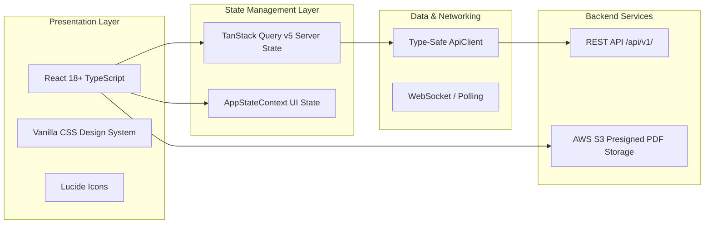

# 🎨 CLAQ Fiscal Alert – Frontend Engineering Blueprint & Implementation Guide

---

## 1. Executive Overview & Mission
Welcome to the Frontend Engineering Team of **CLAQ Fiscal Alert**. Your mission is to build, maintain, and evolve a world-class, enterprise-grade, responsive Web & Mobile SPA for Mozambican tax compliance, real-time fiscal simulation, and legal intelligence.

The application strictly complies with **European Portuguese (`pt-PT`)**, Mozambican tax nomenclature (CIVA, CIRPC, CIRPS, LGT, TAE), official currency formatting (`286 875,00 MZN`), and date standards (`30/06/2026`).

---

## 2. Technical Stack & Dependencies



| Layer | Technology | Purpose |
| :--- | :--- | :--- |
| **Core Framework** | **React 18+ (TypeScript)** | Strongly typed component architecture |
| **Bundler / Runtime** | **Vite 8+** | Sub-second HMR and tree-shaken production builds |
| **Server State & Cache** | **TanStack Query v5** (`@tanstack/react-query`) | Automatic background caching, pagination, optimistic updates |
| **Client UI State** | **AppStateContext** / **Zustand** | Modals, drawers, theme, and client filter context |
| **Iconography** | **Lucide React** (`lucide-react`) | Standardized accessible SVG icon set |
| **PDF Generation** | **jsPDF** & **Backend S3 Stream** | Client preview & official signed PDF certificate generation |
| **Micro-Interactions** | **canvas-confetti** | Delightful feedback on duty settlement & checkout success |

---

## 3. Visual System, Design Tokens & Typography

Defined in `frontend/src/index.css`:

### 🎨 Color Palette
- **Dark Navy (Trust & Financial Gravity)**:
  - `var(--navy-950)`: `#0B132B` (Sidebar, hero card backdrops)
  - `var(--navy-900)`: `#0F172A` (Headers, top navigation)
  - `var(--navy-800)`: `#1E293B` (Dropdown menus, dark accents)
  - `var(--slate-50)`: `#F8FAFC` (Main background)
- **Warm Amber / Gold (Action CTAs & Highlights)**:
  - `var(--gold-500)`: `#F59E0B` (Primary action buttons, seal highlights)
  - `var(--gold-600)`: `#D97706` (Hover states)
  - `var(--gold-50)`: `#FFFBEB` (Badges and alert containers)
- **Status Indicators (Mozambican Standard)**:
  - **Em Dia / Regular (Green)**: `#10B981` (`var(--emerald-500)`) – Settled or compliant duties.
  - **A Vencer / Warning (Amber)**: `#F59E0B` (`var(--gold-500)`) – Due in $\le 7$ days.
  - **Vencidas / Crítico (Red)**: `#EF4444` (`var(--red-500)`) – Past due date.
  - **Informativo / Geral (Blue)**: `#3B82F6` (`var(--blue-500)`) – Legal gazette & reminders.

---

## 4. Screen-by-Screen Implementation Blueprint

### 1. Auth & Single Sign-On (`frontend/src/pages/Login.tsx`)
- **Route**: `/login`
- **What to do**:
  - Connect **Auth0 / AWS Cognito** SSO (Google, Microsoft 365 / Entra ID, Apple, Magic Link).
  - Implement 2-step onboarding KYC modal capturing Company Legal Name, 9-digit NUIT (`400889900`), and Province (Maputo Cidade, Maputo Província, Sofala, Tete, Nampula, Cabo Delgado).
  - Store JWT Bearer token in `localStorage` or `HttpOnly` cookie via `ApiClient`.

### 2. Executive Compliance Dashboard (`frontend/src/pages/Dashboard.tsx`)
- **Route**: `/dashboard`
- **What to do**:
  - **4 Top KPI Cards**: Próxima Obrigação (IVA), INSS Regular, Licenças Activas, Situação Fiscal (Regular).
  - **Mini Calendar June 2026**: Interactive month calendar with color-coded tax chips on the 10th (INSS), 20th (TAE), and 30th (IVA).
  - **Compliance Donut Chart**: Animated SVG gauge showing 85% compliance (12 Em dia, 3 A vencer, 0 Vencidas, 2 A renovar).
  - **WhatsApp Alert Banner**: Action card prompting instant WhatsApp pairing.

### 3. Calendário Fiscal Interactivo (`frontend/src/pages/Calendario.tsx`)
- **Route**: `/calendario`
- **What to do**:
  - Full-month 35-day grid with category badges (IVA, INSS, IRPS, IRPC, TAE, Alvará).
  - Authority filtering (AT - Autoridade Tributária, INSS, Município, BAU).
  - Clicking any date opens the **Day Detail Drawer** with countdown badges, penal risk calculation, and an optimistic **"Marcar como Pago"** button.
  - Export monthly schedule to CSV.

### 4. Centro de Simuladores Tributários (`frontend/src/pages/Simuladores.tsx`)
- **Route**: `/simuladores`
- **What to do**:
  - Multi-step wizard matching Screenshot 2:
    - **Step 1 (Inputs)**: Amount, Currency (USD, EUR, ZAR, GBP), live Banco de Moçambique exchange rate fetch.
    - **Step 2 (Resultados)**: Output cards: $10\,000\text{ USD} \times 63.75 = 637\,500\text{ MZN}$, Contra-Valor $796\,875\text{ MZN}$ (Fator 1,25), IVA 16% ($127\,500\text{ MZN}$), IRPC 20% ($159\,375\text{ MZN}$), Total = **$286\,875,00\text{ MZN}$**.
    - **Step 3 (04 – Memória de Cálculo)**: Step-by-step visual mathematical trace flow.
    - **Step 4 (05 – Base Legal)**: Tabbed citations for CIVA, CIRPC, CDT Treaties, and Diplomas.
    - **Step 5 (06 – Histórico)**: Table of past simulation runs with delete and download actions.
    - **Step 6 (07 – PDF Report Modal)**: Click "Gerar PDF" to trigger the official certificate preview modal with cryptographic seal and QR code.

### 5. Multi-Client Accounting Hub (`frontend/src/pages/Clientes.tsx`)
- **Route**: `/clientes`
- **What to do**:
  - Corporate clients table with NUIT search, health score bars, and status tags (`Regular`, `Alerta`, `Crítico`).
  - Company switcher dropdown in `Header.tsx` allowing accountants to toggle between client dashboards instantaneously.

### 6. Checkout & Mozambican Payments (`frontend/src/components/payments/CheckoutModal.tsx`)
- **Component**: `<CheckoutModal />`
- **What to do**:
  - Tabbed payment checkout:
    1. **M-Pesa (Vodacom)**: Input phone number (`+258 84/85...`), click "Pagar", show spinner waiting for USSD prompt on user's mobile phone.
    2. **E-Mola (Movitel)**: Input phone number (`+258 86/87...`).
    3. **Cartão Ponto24 / SIMO / Visa**: Embedded card fields.
    4. **Bancos MZ**: Display Entidade `99001`, Referência `400 889 900`, and bank accounts for **Millennium BIM**, **BCI**, and **Standard Bank Moçambique**.

### 7. Assistente CLAQ AI & WhatsApp Directo
- **Files**: `frontend/src/components/ai/AIAssistantDrawer.tsx` & `frontend/src/components/whatsapp/WhatsAppModal.tsx`
- **What to do**:
  - Slide-out chatbot drawer with prompt suggestions and Markdown rendering of Mozambican fiscal answers.
  - WhatsApp pairing modal with QR code and live test alert dispatcher.

---

## 5. API Client & Server State Conventions

Always use `ApiClient` (`frontend/src/api/client.ts`) and TanStack Query hooks (`frontend/src/hooks/useFiscalQueries.ts`):

```typescript
import { useQuery, useMutation, useQueryClient } from '@tanstack/react-query';
import { ApiClient } from '../api/client';

export function useSettleObligation() {
  const queryClient = useQueryClient();
  return useMutation({
    mutationFn: (id: string) => ApiClient.patch(`/obligations/${id}/settle`),
    onMutate: async (id) => {
      // Optimistic UI update
      await queryClient.cancelQueries({ queryKey: ['obligations'] });
      const previous = queryClient.getQueryData(['obligations']);
      queryClient.setQueryData(['obligations'], (old: any[]) =>
        old.map(o => o.id === id ? { ...o, status: 'pago' } : o)
      );
      return { previous };
    },
    onError: (err, id, context) => {
      queryClient.setQueryData(['obligations'], context?.previous);
    },
    onSettled: () => {
      queryClient.invalidateQueries({ queryKey: ['obligations'] });
    }
  });
}
```

---

## 6. How to Run & Validate Locally

```bash
# From workspace root:
npm run dev:frontend

# Or from /frontend directory:
cd frontend
npm run dev
```
Open **`http://127.0.0.1:5173/`** to view your changes with instant Hot Module Replacement (HMR).
